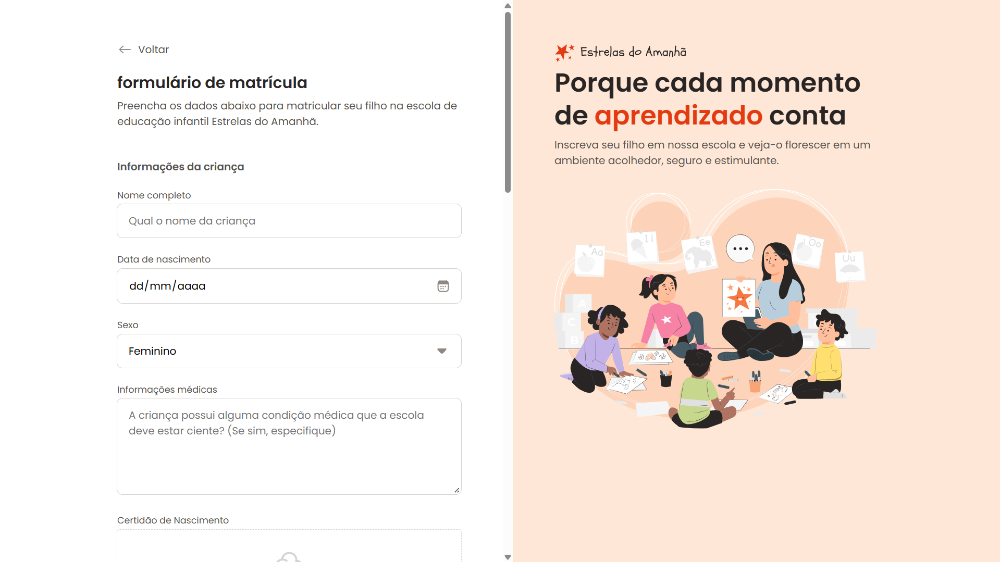
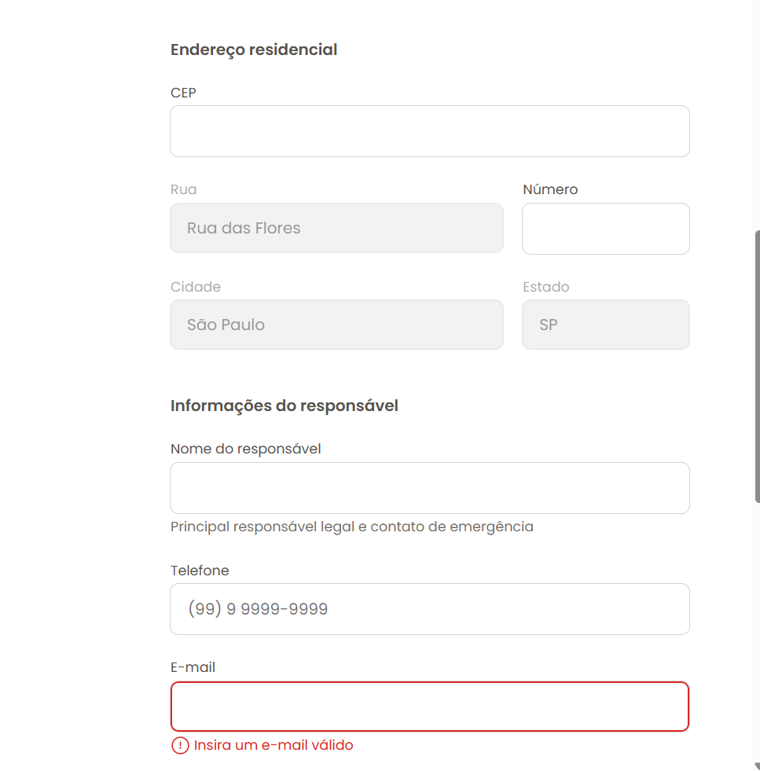
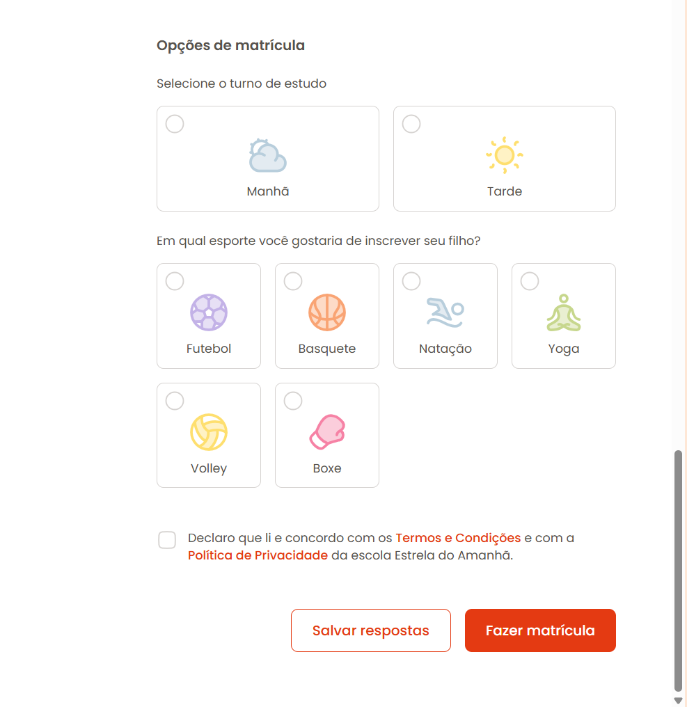

# Formulário de Matrícula

Este repositório contém um formulário de matrícula para a escola de educação infantil 'Estrelas do Amanhã'.

## Visão Geral

O formulário permite que os pais ou responsáveis preencham as informações da criança, dados de contato, informações médicas, endereço residencial e opções de matrícula, incluindo o turno de estudo e esportes.

## Tecnologias Utilizadas

- HTML
- CSS

## Como Usar

1. Clone o repositório:
   ```bash
   git clone https://github.com/FelipeFerreiraAmado/Formulario-de-matricula.git
   ```
2. Abra o arquivo `index.html` no seu navegador.

## Screenshots



### Parte 1 do Formulário




### Parte 2 do Formulário




## Funcionalidades

- Coleta de informações da criança (nome, data de nascimento, sexo, informações médicas).
- Coleta de informações de endereço (CEP, rua, número, cidade, estado).
- Coleta de informações do responsável (nome, telefone, e-mail).
- Seleção de turno de estudo (manhã, tarde).
- Seleção de esporte para inscrição (futebol, basquete, natação, yoga, volley, boxe).
- Termos e Condições e Política de Privacidade.

## Melhorias Futuras

- Validação de formulário mais robusta.
- Integração com backend para persistência de dados.
- Adição de mais opções de esporte e turnos.
- Responsividade aprimorada para diferentes dispositivos.

## Contribuição

Sinta-se à vontade para contribuir com este projeto. Para isso, siga os passos:

1. Faça um fork do repositório.
2. Crie uma nova branch (`git checkout -b feature/sua-feature`).
3. Faça suas alterações e commit (`git commit -m 'Adiciona nova feature'`).
4. Envie para a branch (`git push origin feature/sua-feature`).
5. Abra um Pull Request.

## Licença

Este projeto está licenciado sob a licença MIT. Veja o arquivo [LICENSE](LICENSE) para mais detalhes.